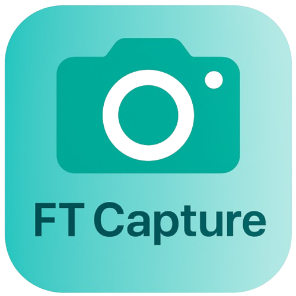
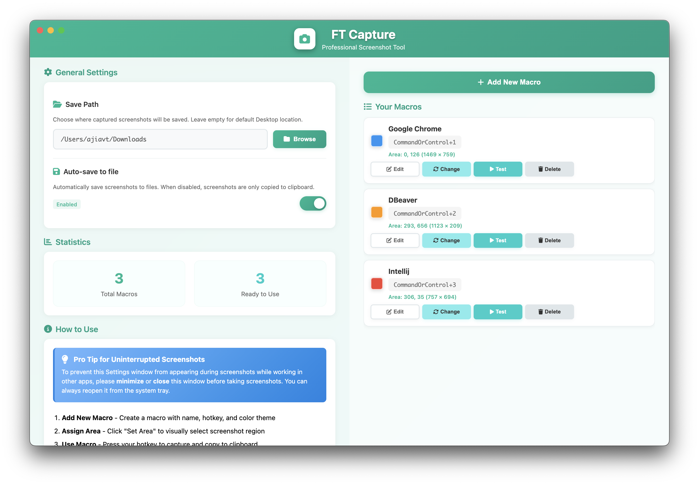
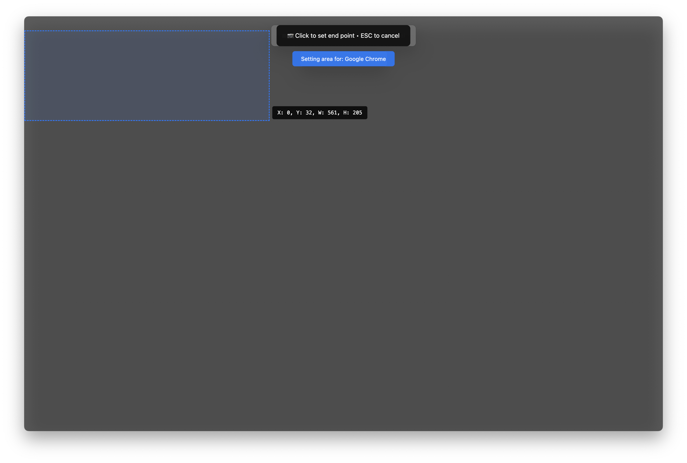
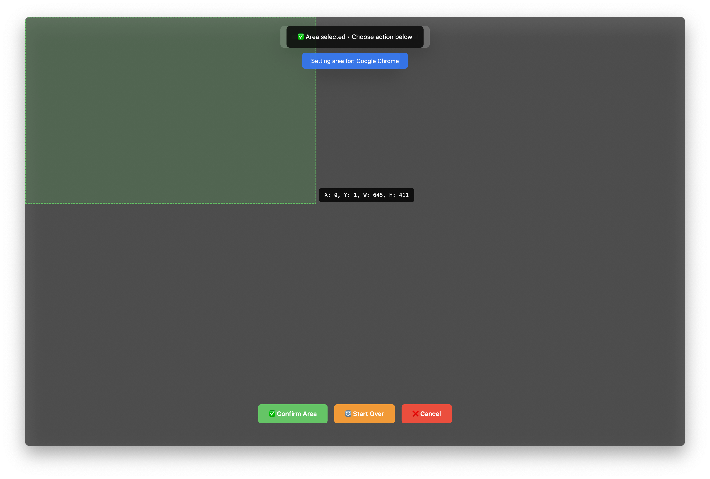
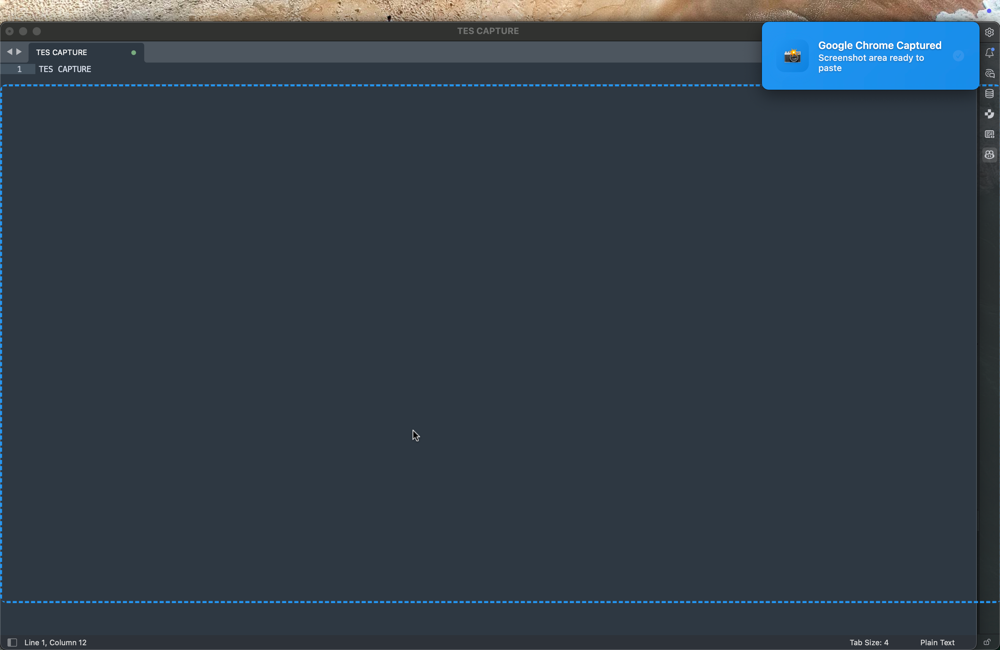

<div align="center">
  
  <h1>🖥️ FT Capture</h1>
  <p><strong>Professional Screenshot Tool with Customizable Hotkeys and Areas</strong></p>
  
  <p>
    
    
    
    
  </p>
  
  <p>
    
    
    
  </p>
  
  <p>
    <a href="https://github.com/ajiavt/ft-capture/releases/latest/download/FT%20Capture-1.0.0-arm64.dmg">
      
    </a>
    <a href="https://github.com/ajiavt/ft-capture/releases/latest/download/FT%20Capture%20Setup%201.0.0.exe">
      
    </a>
  </p>
</div>

---

## 💡 Why I Created This

As a software tester and developer, I found myself constantly frustrated during functional testing documentation at my workplace. The process was painfully repetitive and time-consuming - I needed to capture dozens of screenshots from different areas of the screen for each test case, but existing screenshot tools were simply inadequate for this workflow.

**The Problem:** Traditional screenshot tools forced me to manually select areas every single time, which was:
- ⏰ **Time-consuming** - Wasting precious hours on repetitive manual selections
- 😤 **Frustrating** - Breaking my testing flow and concentration
- 📝 **Inconsistent** - Different area selections led to misaligned documentation
- 🔄 **Inefficient** - No way to automate or standardize the capture process

**The Solution:** I envisioned a macro-based system where I could:
- 🎯 Pre-define specific screen areas once
- ⌨️ Assign keyboard shortcuts to each area
- ⚡ Instantly capture any predefined area with a single keystroke
- 📋 Have screenshots automatically copied to clipboard for immediate pasting

What started as a personal productivity tool to solve my daily testing challenges has evolved into **FT Capture** - a professional screenshot application that transforms the way you document, test, and share visual information.

> *"From hours of manual screenshot work to seconds of automated capture - this tool gave me back my time and sanity during functional testing."*

## ⭐ Features

- 🎯 **Custom Screenshot Areas** - Define specific screen regions and capture them instantly
- ⌨️ **Global Hotkeys** - Assign custom keyboard shortcuts for each capture area
- 📋 **Instant Clipboard** - Screenshots are automatically copied to clipboard for quick pasting
- 💾 **Auto-Save Option** - Optionally save captured screenshots to your chosen directory
- 🎨 **Color-Coded Macros** - Visual themes for easy macro identification
- 🖱️ **Visual Area Selection** - Intuitive drag-and-drop area selection interface
- 🔔 **Smart Notifications** - Beautiful toast notifications with visual feedback
- 🖥️ **Multi-Display Support** - Works seamlessly across multiple monitors
- 📊 **Statistics Dashboard** - Track your macro usage and efficiency

## 🖼️ Screenshots

### Settings Interface
<div align="center">
  
  <p><em>Professional settings interface for managing screenshot macros with intuitive controls</em></p>
</div>

### Area Selection Process
<div align="center">
  
  <p><em>Interactive area selection with visual overlay - simply click and drag to define your capture region</em></p>
</div>

### Selection Confirmation
<div align="center">
  
  <p><em>Clear visual confirmation of selected area before finalizing the macro setup</em></p>
</div>

### Capture Success Notification
<div align="center">
  
  <p><em>Beautiful toast notification with visual feedback when screenshot is successfully captured</em></p>
</div>

## 🚀 Quick Start

### Prerequisites

- Node.js 18+ installed on your system
- Git for cloning the repository

### Installation

1. **Clone the repository**
   ```bash
   git clone https://github.com/ajiavt/ft-capture.git
   cd ft-capture
   ```

2. **Install dependencies**
   ```bash
   npm install
   ```

3. **Run the application**
   ```bash
   npm start
   ```

### Building for Production

**For macOS:**
```bash
npm run build:mac
```

**For Windows:**
```bash
npm run build:win
```

**For all platforms:**
```bash
npm run build
```

## 📖 How to Use

### 1. Create a New Macro
- Click "Add New Macro" in the settings window
- Enter a descriptive name (e.g., "Top Navigation Bar")
- Set a unique hotkey combination (e.g., `Cmd+1`, `Ctrl+Shift+A`)
- Choose a color theme for visual identification

### 2. Define Screenshot Area
- Click "Set Area" for your new macro
- The screen will dim with selection overlays
- Click and drag to select the desired capture area
- Release to confirm the selection

### 3. Start Capturing
- Press your assigned hotkey anywhere on your system
- The defined area will be captured instantly
- Screenshot is automatically copied to clipboard
- Use `Ctrl+V` (or `Cmd+V`) to paste in any application

### 4. Manage Your Macros
- **Edit**: Modify name, hotkey, or color
- **Change Area**: Redefine the capture region
- **Test**: Preview capture without using hotkey
- **Delete**: Remove unwanted macros

## ⚠️ Important Usage Notes

### Settings Window Behavior
To prevent the Settings window from appearing during screenshots while working in other applications:

- **✅ Recommended**: **Minimize** or **close** the Settings window before taking screenshots
- **✅ Alternative**: Keep the Settings window focused only when actively configuring macros
- **📌 Access**: You can always reopen Settings from the system tray icon

*This ensures uninterrupted workflow when capturing screenshots while working in other applications.*

## ⌨️ Default Hotkeys

| Action | Hotkey | Description |
|--------|---------|-------------|
| Open Settings | `Right-click tray icon` | Access main configuration |
| Quick Capture | `Custom hotkeys` | Capture assigned areas |
| Cancel Selection | `Esc` | Exit area selection mode |

## 🛠️ Configuration

### Settings Options

- **Save Path**: Choose where screenshots are saved (default: Desktop)
- **Auto-save**: Toggle automatic file saving (disabled by default)
- **Color Themes**: Customize macro identification colors

### File Locations

- **Settings**: Stored in system-specific config directory
- **Screenshots**: Saved to configured path or Desktop
- **Logs**: Available in developer console for debugging

## 🏗️ Architecture

FT Capture is built with a modular Object-Oriented Programming (OOP) architecture:

- **TrayManager**: System tray integration and menu handling
- **WindowManager**: Application window lifecycle management
- **CaptureManager**: Screenshot capture and processing logic
- **MacroManager**: Macro CRUD operations and hotkey registration
- **IPCManager**: Inter-process communication handling
- **AreaSelector**: Visual area selection interface

## 🔧 Development

### Project Structure

```
ft-capture/
├── src/
│   ├── main.js              # Application entry point
│   ├── settings.html        # Settings interface
│   ├── overlay.html         # Area selection overlay
│   ├── classes/             # Modular OOP classes
│   ├── css/                 # Stylesheets
│   └── js/                  # Frontend JavaScript
├── assets/                  # Static assets and icons
├── package.json             # Dependencies and scripts
└── README.md               # This file
```

### Available Scripts

- `npm start` - Run the application in development mode
- `npm run dev` - Run with development flags
- `npm run build` - Build for all platforms
- `npm run build:mac` - Build for macOS
- `npm run build:win` - Build for Windows

### Contributing Workflow

1. Fork the repository
2. Create a feature branch (`git checkout -b feature/amazing-feature`)
3. Make your changes
4. Commit your changes (`git commit -m 'Add amazing feature'`)
5. Push to the branch (`git push origin feature/amazing-feature`)
6. Open a Pull Request

## 📋 Requirements

### System Requirements

- **Operating System**: macOS 10.14+, Windows 10+, or Linux (Ubuntu 18.04+)
- **Memory**: 4GB RAM minimum, 8GB recommended
- **Storage**: 200MB free space
- **Display**: Any resolution supported

### Dependencies

- **Electron**: Cross-platform desktop app framework
- **electron-store**: Persistent data storage
- **Font Awesome**: Icon library for UI elements

## 🤝 Contributing

Contributions are welcome! Please feel free to submit a Pull Request. For major changes, please open an issue first to discuss what you would like to change.

1. Fork the Project
2. Create your Feature Branch (`git checkout -b feature/AmazingFeature`)
3. Commit your Changes (`git commit -m 'Add some AmazingFeature'`)
4. Push to the Branch (`git push origin feature/AmazingFeature`)
5. Open a Pull Request

## 📄 License

This project is licensed under the MIT License - see the [LICENSE](LICENSE) file for details.

## 🐛 Bug Reports & Feature Requests

If you encounter any bugs or have feature requests, please [create an issue](https://github.com/ajiavt/ft-capture/issues) on GitHub.

## 💬 Support

- 📧 Email: ajiavt@gmail.com
- 🐛 Issues: [GitHub Issues](https://github.com/ajiavt/ft-capture/issues)
- 💡 Discussions: [GitHub Discussions](https://github.com/ajiavt/ft-capture/discussions)

## 🙏 Acknowledgments

- Built with ❤️ using Electron
- Icons from [Font Awesome](https://fontawesome.com/)
- UI design inspired by modern macOS applications
- Special thanks to the Electron community

---

<div align="center">
  <p>Made with ❤️ by <a href="https://github.com/ajiavt">ajiavt</a></p>
  <p>⭐ Star this repo if you find it helpful!</p>
</div>
